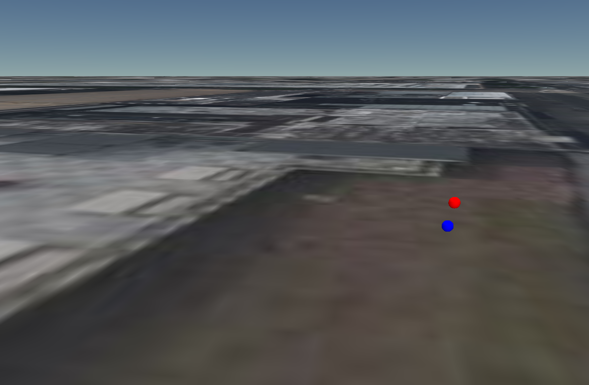
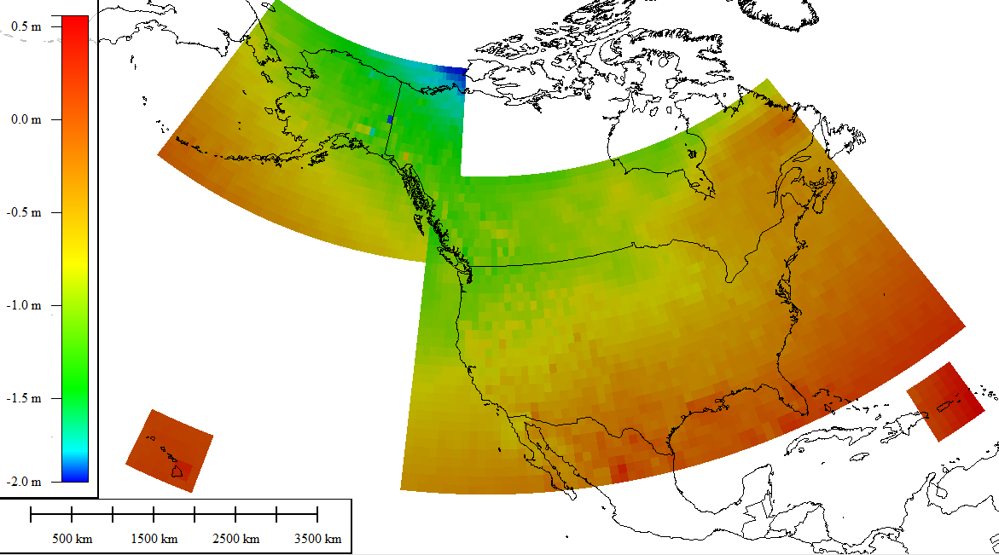

<!-- omit in toc -->

# Geospatial Guide

This guide is meant to give a brief overview of the terminology and topics that come up when working with Cesium. If you've been confused by terms like "EPSG codes," "vertical datums," or "ECEF coordinates," this is the place to look!

This guide is structured in a Q&A style for maximum searchability and extensibiliy. Pull requests are welcome for additional topics.

If you're interested in diving deeper into a specific topic check out the `Resources` links provided in some sections. These resources are also highly recommended:

- [Basic GIS Coordinates](https://www.amazon.com/Basic-GIS-Coordinates-Jan-Sickle/dp/0367573512/ref=sr_1_1?dchild=1&keywords=gis+coordinates&qid=1627262169&s=books&sr=1-1)
- [3D Engine Design for Virtual Globes](https://www.amazon.com/3D-Engine-Design-Virtual-Globes/dp/1568817118)
- [A tutorial on Datums - NOAA](https://vdatum.noaa.gov/docs/datums.html)
- [What are map projections? - Esri](https://desktop.arcgis.com/en/arcmap/latest/map/projections/what-are-map-projections.htm)
- [A guide to coordinate systems in Great Britain - Ordnance Survey](https://www.childs.be/data/uploads/guide-coordinate-systems-great-britain.pdf) -- Though focused on Great Britain, the introductory chapters give a good overview of geospatial concepts.

<!-- omit in toc -->

## Table of contents

- [Geospatial Concepts](#geospatial-concepts)
  - [What is the shape of the earth?](#what-is-the-shape-of-the-earth)
  - [What is an ellipsoid?](#what-is-an-ellipsoid)
  - [What is a reference ellipsoid?](#what-is-a-reference-ellipsoid)
  - [What is a geoid?](#what-is-a-geoid)
  - [What is Earth Gravitational Model (EGM)?](#what-is-earth-gravitational-model-egm)
  - [What is Mean Sea Level (MSL)?](#what-is-mean-sea-level-msl)
  - [What is height measured from?](#what-is-height-measured-from)
  - [What is a datum?](#what-is-a-datum)
  - [What is a grid shift file?](#what-is-a-grid-shift-file)
- [Coordinate Reference Systems](#coordinate-reference-systems)
  - [What is a Coordinate Reference System?](#what-is-a-coordinate-reference-system)
  - [What are Geographic coordinates?](#what-are-geographic-coordinates)
  - [What are Cartographic coordinates?](#what-are-cartographic-coordinates)
  - [What are Cartesian coordinates?](#what-are-cartesian-coordinates)
  - [What are Geocentric coordinates?](#what-are-geocentric-coordinates)
  - [What are ECEF coordinates?](#what-are-ecef-coordinates)
  - [What are ENU coordinates?](#what-are-enu-coordinates)
  - [Why is 64-bit precision required?](#why-is-64-bit-precision-required)
  - [What's the difference between geocentric and geodetic latitude?](#whats-the-difference-between-geocentric-and-geodetic-latitude)
  - [What's the difference between geocentric and geodetic surface normal?](#whats-the-difference-between-geocentric-and-geodetic-surface-normal)
  - [What is WGS84?](#what-is-wgs84)
  - [What are NAD83 and NAVD88?](#what-are-nad83-and-navd88)
- [Projections](#projections)
  - [What is a map projection?](#what-is-a-map-projection)
  - [What is Web Mercator?](#what-is-web-mercator)
  - [What is Universal Transverse Mercator (UTM)?](#what-is-universal-transverse-mercator-utm)
  - [What is the State Plane Coordinate System (SPCS)?](#what-is-the-state-plane-coordinate-system-spcs)
- [Coordinate Reference System Definition Styles](#coordinate-reference-system-definition-styles)
  - [How are Coordinate Reference Systems specified?](#how-are-coordinate-reference-systems-specified)
  - [What are EPSG codes?](#what-are-epsg-codes)
  - [What is Well-Known Text (WKT)?](#what-is-well-known-text-wkt)
  - [What is a proj-string?](#what-is-a-proj-string)
  - [What is a PROJJSON?](#what-is-a-projjson)

## Geospatial Concepts

### What is the shape of the earth?

The question "What is the shape of the earth?" depends on how precise you need to model the earth

- If you're zoomed out really far (e.g. modeling planets in the solar system) you might be able to get away with modeling the earth as a perfect sphere.
- Zoom in a bit more to where we care about continents or countries, and we see that a spherical earth doesn't line up with data quite right. We can use an ellipsoid as a better model. The earth is squished slightly along the direction between north and south poles, so an oblate spheroid is a good model for this. The WGS84 ellipsoid is a common example of this.
- If we care about a specific country/region of the world, the WGS84 ellipsoid might not be the best ellipsoid. There are others out there designed for higher accuracy at a given part of the globe.
- However, when surveying land in a small region, the ellipsoid is not precise enough. The real earth's surface is a lot more irregular due to a number of reasons such as large-scale features like oceans or mountains. Earth is a non-uniform shape so even the strength of gravity varies slightly from place to place. Geoid models can be used to model these irregularities.


<sub>_Image source: modified from http://www.geo.hunter.cuny.edu/~jochen/gtech201/lectures/lec6concepts/Datums/Basics%20of%20datums.htm_</sub>

### What is an ellipsoid?

An ellipsoid is an implicit surface defined by the equation

$\frac{x^{2}}{a^{2}}+\frac{y^{2}}{b^{2}}+\frac{z^{2}}{c^{2}} = 1$

Where a, b, and c are the three radii along the x, y and z-axes respectively.

If two radii have the same length the ellipsoid is a spheroid. If the third axis is shorter the ellipsoid is an oblate spheroid. The larger radii of equal length are called the semi-major axes and the smaller radius is called the semi-minor axis. The bottom left ellipsoid below is an oblate spheroid.


<sub>_Image source: https://en.wikipedia.org/wiki/Ellipsoid#/media/File:Ellipsoide.svg_</sub>

### What is a reference ellipsoid?

A reference ellipsoid is used to approximate the shape of the Earth or other planetary bodies. The Earth has characteristics of an oblate spheroid: it is equidistant at the equator and wider at the equator than the poles. Reference ellipsoids for the Earth are often defined by two parameters: a semi-major axis and inverse flattening, where flattening is defined by the equation:

$f = \frac{a-b}{a}$

where `a` is the semi-major axis and `b` is the semi-minor axis.

The most common global reference ellipsoid is the one defined by WGS84, however other ellipsoids may provide higher accuracy at a given part of the globe. North American datums like NAD83 and NAVD88 use GRS80.

As an example, here are a selection of reference ellipsoids and their semi-major axis and flattening parameters.

| Ellipse                | Semi-Major Axis | Flattening    |
| ---------------------- | --------------- | ------------- |
| Airy 1830              | 6377563.396     | 299.3249646   |
| Bessel 1841            | 6377397.155     | 299.1528128   |
| Clarke 1866            | 6378206.4       | 294.9786982   |
| Clarke 1880            | 6378249.145     | 293.465       |
| Everest 1830           | 6377276.345     | 300.8017      |
| Fischer 1960 (Mercury) | 6378166         | 298.3         |
| Fischer 1968           | 6378150         | 298.3         |
| GRS 1967               | 6378160         | 298.247167427 |
| GRS 1975               | 6378140         | 298.257       |
| GRS 1980               | 6378137         | 298.257222101 |
| Hough 1956             | 6378270         | 297.0         |
| International          | 6378388         | 297.0         |
| Krassovsky 1940        | 6378245         | 298.3         |
| South American 1969    | 6378160         | 298.25        |
| WGS 60                 | 6378165         | 298.3         |
| WGS 66                 | 6378145         | 298.25        |
| WGS 72                 | 6378135         | 298.26        |
| WGS 84                 | 6378137         | 298.257223563 |

<sub>_Table adapted from [UC Santa Barbara Core Curriculum-Geographic Information Science (1997-2000)](https://escholarship.org/content/qt9df9n46v/qt9df9n46v.pdf)._</sub>

### What is a geoid?

A geoid is an irregular surface that models Earth's gravity field and approximates mean sea level. A geoid is a equipotential surface meaning all points on the surface have the same geopotential (gravitational force + centrifugal force). A geoid is a more accurate representation of the shape of the Earth than an ellipsoid, however it does not perfectly match the terrestrial surface.

There are many local geoid models that provide higher resolution for specific areas.

| Geoid at 10000x scale                                                                                                       | Geoid at 1x scale                                                                                       |
| --------------------------------------------------------------------------------------------------------------------------- | ------------------------------------------------------------------------------------------------------- |
|  |  |

<sub>_Image source: https://en.wikipedia.org/wiki/Geoid_</sub>

The image below illustrates how the gravitational force (blue arrow) and centrifugal force (red arrow) produce the net force of gravity (green arrow). The gravitational force is stronger at the poles because they are closer to the center of mass. The centrifugal force is caused by inertia of the earth's rotation, which is strongest at the equator. See http://www.freemars.org/jeff/Earth/down.htm for more details.


<sub>_Image source: http://www.freemars.org/jeff/Earth/down.htm_</sub>

### What is Earth Gravitational Model (EGM)?

Earth Gravitational Model (EGM) is the most common global geoid. It is based on complicated models that are continually refined. Several versions have been published: EGM84, EGM96, EGM2008, and EGM2020. The data is provided as a grid of height values which is available in OSGeo's [PROJ-data](https://github.com/OSGeo/PROJ-data/tree/master/us_nga) repository.

### What is Mean Sea Level (MSL)?

Global Mean Sea Level (MSL) is the average height of the entire ocean surface. If the world's oceans were connected by narrow channels sliced through the continents this is what the hypothetical ocean surface would look like. Mean Sea Level is determined by averaging the ocean surface over a period time to account for changes in tide, wind, temperature, salinity, etc.

For our purposes mean sea level is equivalent to the latest EGM model. Like EGM it is an irregular surface, not a smooth surface like an ellipsoid.

### What is height measured from?

Height can be measured from multiple reference points.

- **Ellipsoidal height** is measured from the ellipsoid to the surface
- **Geoid height** is measured from the ellipsoid to the geoid
- **Orthometric height** is measured from the geoid to the surface

For our purposes orthometric height is equivalent to height above or below mean sea level.


<sub>_Image source: https://www.sciencedirect.com/science/article/pii/S1674984720300173_</sub>

Since orthometric height is measured from the geoid, an equipotential surface, it is not a straight line height but rather the distance along the curved plumb line from the geoid to the surface. Therefore the ellipsoidal height only approximately equals the orthometric height plus the geoid height, unlike shown in the simplified picture above.


<sub>_Image source: https://www.researchgate.net/figure/The-relationship-of-ellipsoid-height-h-orthometric-height-H-and-geoid-height-N-at_fig3_268516558_</sub>

Most websites that let you query elevation data, such as the [USGS National Map - Elevation Point Query Service](https://nationalmap.gov/epqs/), return orthometric heights. Be aware that this is not the same as ellipsoidal height which Cesium uses internally for things like [`sampleTerrainMostDetailed`](https://cesium.com/downloads/cesiumjs/releases/1.56/Build/Documentation/sampleTerrainMostDetailed.html). The values can differ by tens of meters depending on the geoid and the location. The image below shows the height difference between the EMG96 geoid and the WGS84 ellipsoid.


<sub>_Image source: https://en.wikipedia.org/wiki/Geoid#/media/File:Earth_Gravitational_Model_1996.png_</sub>

The words "elevation", "altitude", and "depth" generally refer to orthometric heights, or heights above or below mean sea level.

- **Elevation** - height above mean sea level for points on the surface
- **Altitude** - height above mean sea level for points above the surface, such as aircraft
- **Depth** - height below mean sea level

In some contexts "Height" means the height from the surface to a point above the surface.


<sub>_Image source: https://www.quora.com/How-do-ultralight-aircraft-control-their-altitude-gain-or-loss-thereof_</sub>

### What is a datum?

A datum is a model of the Earth used to measure positions. There are two types of datums:

- **Horizontal datum**: used to measure positions along the surface of the Earth (typically longitude and latitude)
- **Vertical datum**: used to measure height from the surface

A horizontal datum is based on a reference ellipsoid, while a vertical datum is based on a reference ellipsoid or geoid or some other reference point. Generally speaking, a horizontal datum is used to measure positions along the surface and a vertical datum is used to measure height from the surface. Together they produce a position on the globe.

There are a wide variety of global and local datums. Many countries have a national datum that provides the best accuracy for their geographic area.

Common horizontal and vertical datums are listed below:

| Horizontal Datum | Full Name                      | Area                              | Ellipsoid     |
| ---------------- | ------------------------------ | --------------------------------- | ------------- |
| WGS84            | The World Geodetic System 1984 | Global                            | WGS84         |
| NAD83            | North American Datum of 1983   | North America, Caribbean          | GRS80         |
| NAD27            | North American Datum of 1927   | North America                     | Clarke 1886   |
| ED50             | European Datum 1950            | Europe, Middle East, North Africa | International |

| Vertical Datum | Full Name                                 | Area                       |
| -------------- | ----------------------------------------- | -------------------------- |
| EMG96          | Earth Gravitational Model 1996            | Global                     |
| EMG2008        | Earth Gravitational Model 2008            | Global                     |
| NAVD88         | North American Vertical Datum 1988        | North America              |
| NGVD29         | The National Geodetic Vertical Datum 1929 | Conterminous United States |

### What is a grid shift file?

A grid shift file is used to transform coordinates from one datum to another wherever a mathematically definable transformation doesn't exist. These files can be quite large depending on the resolution of the data. Many public grid shift files are available in [OSGeo/PROJ-data](https://github.com/OSGeo/PROJ-data).

The most common file formats for grid shifts are `.gsb` (horizontal shifts), `.gtx` (vertical shifts), and `.tif` (either horizontal or vertical shifts). GeoTIFF is the standard in PROJ since version 6.

Grid shift files serve two main purposes:

- Store height values for vertical datums / geoids such as [EGM96 and EGM2008](https://github.com/OSGeo/PROJ-data/tree/master/us_nga)
- Transformation between different horizontal datums
  - [NAD27 to NAD83](https://github.com/OSGeo/PROJ-data/tree/master/us_noaa)
  - [GDA94 to GDA2020](https://github.com/OSGeo/PROJ-data/tree/master/au_icsm)

**Note**: Australia sits on one of the Earth's fastest moving tectonic plates and requires significant horizontal datum shifts from GDA94 to GDA2020.

| Tectonic plate shifts                                                                                                                                             | GDA94 to GDA2020                                                                                                                                                             |
| ----------------------------------------------------------------------------------------------------------------------------------------------------------------- | ---------------------------------------------------------------------------------------------------------------------------------------------------------------------------- |
|  |  |

<sub>_Image source: https://www.digital.nsw.gov.au/article/earth-really-moving-good-news-were-tracking-it_</sub>

## Coordinate Reference Systems

### What is a Coordinate Reference System?

A Coordinate Reference System (CRS) is a local, regional, or global system used to represent the locations of geographic features. It is also sometimes called a Spatial Reference System (SRS). What we call "projections" are really a subset of coordinate reference systems.

A CRS can be one of the following types:

- **Geodetic**
  - **Geographic 2D** - longitude, latitude
  - **Geographic 3D** - longitude, latitude, height
  - **Geocentric** - global cartesian coordinates - x, y, z
- **Projected** - local cartesian coordinates in a 2D projected space - x, y
- **Vertical** - defines the vertical datum that height values are relative to
- **Compound** - combination of a horizontal + vertical CRS. A horizontal CRS may be a geographic 2D or projected CRS
- **Local** - local cartesian coordinates - x, y, z

### What are Geographic coordinates?

Geographic coordinates are spherical coordinates mapped to a reference ellipsoid. They consist of three elements:

- **Longitude**: a value between -180° and +180° that defines the position along the equator relative to the prime meridian. Longitude increases from West to East. The sign flips from +180° to -180° at the antimeridian which goes through the Pacific Ocean (sometimes we refer to this as the International Date Line, though IDL is a more complex shape than a meridian).
- **Latitude**: a value between -90° and +90°, where -90° denotes the south pole, 0° denotes the equator, and +90° denotes the north pole. Latitude increases from South to North.
- **Height**: a value in meters that defines the height above or below the ellipsoid.


<sub>_Image source: https://en.wikipedia.org/wiki/File:Latitude_and_Longitude_of_the_Earth.svg_</sub>

> **Note:** there are different conventions for whether geographic coordinates are given as (latitude, longitude) or (longitude, latitude). There are also different conventions for units. These are defined by the coordinate reference system. The convention in Cesium is (longitude, latitude, height) where longitude and latitude are radians and height is meters. This ordering makes it more straightforward to transform geographic coordinates to local east-north-up (x, y, z) coordinates or global x, y, z coordinates.

### What are Cartographic coordinates?

Cartographic coordinates are geographic coordinates given as

- Longitude in radians
- Latitude in radians
- Height in meters

The term cartographic coordinates is mainly found within Cesium code and not used frequently elsewhere. This guide uses the more general term geographic coordinates throughout.

### What are Cartesian coordinates?

Cartesian coordinates are 2D or 3D rectilinear coordinates.

| 2D                                                                                       | 3D                                                                                       |
| ---------------------------------------------------------------------------------------- | ---------------------------------------------------------------------------------------- |
|  |  |

### What are Geocentric coordinates?

Geocentric coordinates are cartesian coordinates relative to the center of the Earth. Since the Earth's radius is roughly 6,378,137 meters at the equator, geocentric coordinates on the Earth's surface are typically in the six million to seven million range.

### What are ECEF coordinates?

Earth-Centered, Earth-Fixed (ECEF) coordinates are geocentric coordinates that are fixed to Earth; as Earth rotates, the system also rotates, and objects defined in ECEF remain fixed relative to Earth.


<sub>_Image source: https://en.wikipedia.org/wiki/Earth-centered_inertial#/media/File:Earth_Centered_Inertial_Coordinate_System.png_</sub>

ECEF is in contrast to ECI (Earth-Centered Inertial) where the axes are fixed and the earth spins.


<sub>_Image source: https://www.youtube.com/watch?v=DbYapFLJsPA_</sub>

### What are ENU coordinates?

ENU coordinates are cartesian coordinates in a local East-North-Up reference frame where `X = East`, `Y = North`, and `Z = Up`. There are many cases where it is useful to transform positions into ENU space:

- Applying a scaling factor to tilesets in a local area.
- Interfacing with libraries that expect 2D planar coordinates.
- Converting data into a local coordinate space.

See this [sandcastle](https://sandcastle.cesium.com/#c=lVZtb+I4EP4rUb8QpNQkBEoo3ep2232ptNuuruydTuKLSaZg1bEj26HlTvvfb+I4L9BupeUDxOOZZ555POOwo8rbMXgC5b3zBDx5V6BZmZO/rM0fpHZ5JYWhTIAaBN5/K+Hhx4BSaDpvApb1mjwomf8tFc+cwR+uxM/hYiVWos5DdAoCyIbLNZAMCrNdgjbvN+irjQtCLkaVUEchQyaYYZR/lxp/ZbXtsl5RZfCJitgmvoaNAtD+6WxCwihJojgcJ2E4niSBNwnJ2TyKJnEcz6JJMo4CbzaNK2a9DHeKAZbqkvT0+AI0Y2LznZl0+6fk/CDdOCLjWTKbJ7NkPI+TeBp4p2iLJ/E8nE7DZDaenGG6kISz6Gw+jeZIbZ5MoqnN3lclpTkoSjSY6gB8p3WGAjFhWZ0faxHULrIjfv5KMc4LRLZUVOgHqfL25L5Ro9jzhNxcf7xd3iz/6c4LdTGMA7JBMegTZabV3f7E18t626pxI8V7jYubzEdhJ/GL4grFciS2A01olvkOus71UIrUqr4B85FqcyuV2f4oWraNd+Ap4LQC+QJsszXDph8rsijCpm4eR2stS1Ed232xBYXqohygFl1Aiu0jN4oWW5YeNlVjtZW1XebXGYYOoh9OtpYPohwSXLTnU1N7LYeRXYY+5rBHFUTZRbeyaAI9seQn9gzZJ4VNdMRUgSmVqEDQ8PNY8PuUcnhFal3Z31TcyM84x5Qjtd89uEUf5atMLchRSzKxA6XBb9IE/ZF0Tv6wD8UrIFvP4fx2F4UfkTDw7Jet7/XoGvwlo6odrIPf+R6U0tT9MjQvuWEF3/eq+ZXHMY+gkegXArytizv8llrTAjt393+TGVTiu3O1qpxXCqGfHU4H/Chk+ihLQxApffTb0N5tISVf0+pVksm0zHHcSNUWHKrHD3u8GQbOZVAFHePSAov/wOzI6g4/aHC7RIe9hPnwbl14o1FNXrf7GOmZLdOem07sd7MFDzhnhZYse606ZHy31qB2dI3H3GMxsOCDIdHlWqeKrcFvpsivW+lAQmR1W+ZrfIse9Bl78Hymb+mtM7dB3VE5T3tI9l3rrjMlpRW/7bDfnt1Fe7mvxElwcqHNnsNlneUPlhc4vF6puE/IyEBeYCzo0bpMHzF7qnUVejFqgi4ytvNY9m51cvQvYXXipZxqjTsPJef37F9YnVxejND/IIxL+1K9wyHndF+5bKPLr7WREHIxwuXLKNcM6F7zrnYurQyNr7UyUZTGM/sCMAb12SAHL2cCVyGJqmf6jM8Rdg4utIGi3cmooadr7EO07CgvcRqcnHb1o0AHtA1sikFH5CClgWdTAWPxuJq+AWsBGu7/Aw) for computing the ENU transform.

ENU coordinates are not suitable for data that spans over half the globe.


<sub>_Image source: Cesium_</sub>

### Why is 64-bit precision required?

64-bit floating point precision is required to represent geodetic coordinates accurately. This includes both geocentric coordinates, which are typically very large numbers, and geographic coordinates, which are smaller but very precise numbers.

Starting with geocentric coordinates...

- The geocentric coordinates for our office are
  - `x: 1254151.3944734565`
  - `y: -4732843.845023793`
  - `z: 4073794.407620059`
- The closest representable values in 32-bit floating point are
  - `x: 1254151.375`
  - `y: -4732844`
  - `z: 4073794.5`

The results in an error of about 0.25 meters, or over half a foot.

Next, geographic coordinates...

- The geographic coordinates for our office are:
  - `longitude: -75.15836368768382`
  - `latitude: 39.95090650840344`
  - `height: -21.668226434267066`
- The closest representable values in 32-bit floating point are
  - `longitude: -75.15836334228515625`
  - `latitude: 39.95090484619140625`
  - `height: -21.6682262420654296875`

When converted back to geocentric coordinates the distance between these two positions is 0.187 meters.



<sub>_Image source: Cesium_</sub>

[This sandcastle](https://sandcastle.cesium.com/#c=vVbJbtswEP0VQicZVWlZktc4QRvHQQ8uCqQL2kQ5MNLEJkqLBkk5dYr8eylrt5T10Ittzrw382Y4GnlLBNpSuAOBjlEEd2gGksZr/GNvM30j2J9nPFKERiB8o3PkR3601byACKW9JKpTZ7nZNXtO3+v1+3joDb3BeDweDCz03hu6zmhgY2fo9OzxyNM2zx66I3uEB57Td/qu6yZJ8hR8KchmRQOdpZIht+JbwddFSrPQVMpkPFpSFYdQBvhM1AorfgZLASDNahZcwHMNjKjX0DN0zl4BXa6U5tZQqbWQeMs4UTJr43lycJ2PQpCdeVXIsQohVhbUKm8A/6kedtXD/XUuha43AgIqYVHpSJr6yr5ugMqyM0yvgfmUF5chnAbiZ+l0G85fpdNrOC9LZ/+66FTmnFVGrzF2ONBNg/oo1ELPnh3cUr9VkVv5fdlpk/SCUc2H5ol7zfUeqj3PJv2ZLIqXj0OLttZuvEJ4c4qs5tBYhzPy+B28oapW6fW9lFvnQnDROiQhlYpEAZjPCbJeILq6r/aAN+Rty5MWFfBIcgZ6NS31Ri6nF5IkE+Qb6N1B5oTXZBUtPiTWulU2UpCQxslasrE9KKw3LIY5Y3QjOQ21M319YIj01VOQmISh+dePEIrIGpIkp5qAIGf4hpU4N1xqOI8mjTHfuwv4BO1job0YOnnkeU2VWqj+3bFS6pooEJSwScHkjAt8uvg+3yMe9OdDpWwIX1XfBYRPlNe81P9W4MX8rFFfWsw95+tv3DworXNkWMZUqh2DkzQwQh+0fi4UigUzMe4qWG/0vgLZvYmD36BwIGUSOYFOu1XqNKRbRMPjlr8QKGBESu25jRn7Su/BN06mXY1vUPX+D2m0/LIFwcguga16J4vUiDGedvWxnak4ZzdEHET+Bw) has the code for computing these numbers.

Wherever possible use 64-bit floating point types for representing geodetic coordinates

- In C++ use `double` instead of `float`, likewise use `glm::dvec3` instead of `glm::vec3`.
- In Unity use `Unity.Mathematics.double3` instead of `Vector3`.
- In JavaScript numbers are always stored as double precision floats. However, take care when using typed arrays to avoid `Float32Array`.

Special care must be given to engines like Unreal, Unity, and O3DE that use 32-bit floating point math for many operations, graphics APIs such as WebGL that lack 64-bit float support, and GPUs that either don't have 64-bit support or can't do 64-bit floating point math efficiently. The blog post [Precisions, Precisions](https://help.agi.com/AGIComponents/html/BlogPrecisionsPrecisions.htm) goes over some strategies for rendering global scale coordinates on the GPU with high precision.

See Appendix A in [Cesium for Unreal: WGS84 precision at global scale, now for game engines](https://prismic-io.s3.amazonaws.com/cesium/53364bd2-52f7-44c8-afef-f23bf9dd97c2_Cesium+for+Unreal_+March+2021.pdf) for details about how global scale coordinates are handled in Unreal Engine.

### What's the difference between geocentric and geodetic latitude?

Since the Earth is an oblate spheroid rather than a sphere there are two different systems for describing latitude.

- The geocentric latitude of a point is the angle from the equatorial plane
- The geodetic latitude of a point is the angle between the equatorial plane the ellipsoid surface normal


<sub>_Image source: modified from https://www.researchgate.net/publication/323657391_Inertial_Navigation_-_Theory_and_Applications_</sub>

A point described using geocentric latitude and a point described using geodetic latitude can differ by tens of kilometers. Most coordinate reference systems and GIS software use geodetic latitudes. CesiumJS and Cesium Native use geodetic latitude.

### What's the difference between geocentric and geodetic surface normal?

As shown in the image above:

- The geocentric normal is the unit vector directed from the center of the ellipsoid toward the given position
- The geodetic normal is the normal of the plane tangent to the surface of the ellipsoid at the provided position

Only the geodetic surface normal should be used when precision matters, however both methods are available in CesiumJS and Cesium Native.

The image below shows the geocentric and geodetic surface normals at 45° latitude as visualized in [Sandcastle](https://sandcastle.cesium.com/#c=rVTRbtpAEPyVk58cCR2kTaWKENSGorwgiEKUKKr7cNgLOfV8a+2doU6Vf+/aBkOBSiD1xfLuzuzODMJLRWKpYQUkboSFlRiA03kqn6peGAVxVQ/QeqUtUBRcXEd2ySwkvdCWWWvGQJHnN2U/yjlh+g0WBODCjuy0xNWn8smvGzIYozOHOtnyh5uWfL6bfr5aAzM0heHD01gZYPBlh7fwrJ4uAGOwnnQ8RkqVYUCzWW6H05zmKoYaE9bCW7tut9rDi41Epifg/7W5Gp29d1/1E8Qe6WiGaW68zkxxW5TWFYX7Xlt/Z3OynzNv7mRwzsV9p/eorT96VCVJE91+MiebOnn9TgQn6N/4vWt08Y367yK51l6Dqy78jqxo0F1RlWXDMQSt64rvhxYrzT9aNXSlE//aFR/WZao8kFam2+hDgyRfhqPR5HmNURQ/Fhlfi4LxZDyMgqr/zs/3ow4q6/9D/zbx89QPXr6OT9XO6muZb4jpI4aHv8TaY43KHdwSrhzQA8SYpmATSB7AoclLA+x6royD64bgeAtINujviTc6N/VqwWHMfynF0aiZgfLb5CkvSUEr6DlfGOjX8oX4otMMyYucTChl20OaGXbt2rM8/glexs6VAktor71L7SV6KXRyc+TLKmKjnOPJPDdmqt8gCvq9NuMPqAZVou1isgQyqihhr5f9Ud2UUvbaXB5nekQzU7S3+Q8).


<sub>_Image source: Cesium_</sub>

### What is WGS84?

The World Geodetic System (WGS84) defines a reference ellipsoid, horizontal datum, vertical datum, and coordinate system for the Earth. WGS84 defines both a geocentric coordinate system and geographic coordinate system. Usually when we think of ECEF coordinates (x, y, z) or geographic coordinates (longitude, latitude, height) we think of WGS84.

- WGS84 defines an Earth-Centered, Earth-Fixed (ECEF) right-handed coordinate system. Its origin is located at the center of the earth. The X-axis points through the intersection of the equator and the prime meridian. The Y-axis points through the intersection of the equator and 90° longitude. The Z-axis points to the north pole. The default unit is meters.
- The semi-major axis is 6,378,137 meters and the flattening is 298.257223563. This yields radii of
  - a: `6378137.0`
  - b: `6378137.0`
  - c: `6356752.3142451793`
- WGS84 currently uses the EGM2008 geoid for its vertical datum (this is updated over time)
- The prime meridian (longitude 0°) is the IERS Reference Meridian which is 5.3 arc seconds east of the Greenwich meridian.

There are three EPSG most commonly associated with WGS84:

| EPSG code   | Description                                                                    | Type          |
| ----------- | ------------------------------------------------------------------------------ | ------------- |
| `EPSG:4326` | WGS84 Geographic Coordinates - latitude, longitude (degrees)                   | Geographic 2D |
| `EPSG:4979` | WGS84 Geographic Coordinates - latitude, longitude (degrees) + height (meters) | Geographic 3D |
| `EPSG:4978` | WGS84 3D Cartesian Coordinates - x, y, z (meters)                              | Geocentric    |

| Geocentric coordinate system                                                | Geographic coordinate system                                                |
| --------------------------------------------------------------------------- | --------------------------------------------------------------------------- |
|  |  |

<sub>_Image source: Cesium_</sub>

WGS84 is defined and maintained by the United States National Geospatial-Intelligence Agency (NGA). It was first published in 1984 but has been revised multiple times since. WGS84 initially used the GRS80 reference ellipsoid used by NAD83. Now it approximates the latest International Terrestrial Reference Frame (ITRF). WGS84 is the reference coordinate system used by GPS while ITRF is the reference coordinates system for the International GNSS Service (IGS).


<sub>_Image source: https://www.everythingrf.com/community/what-is-the-difference-between-gnss-and-gps_58_</sub>

Since WGS84 is continually being revised it's important for datasets to specify their WGS84 realization, otherwise there may be a small amount of error when comparing datasets. However if it is known that one dataset is realization G730 and another is G1762, for example, then the 10 cm translation difference (see table below) can be baked into the positions of the first dataset so that both now share a common realization.

Generally all datasets should be normalized to the same realization before fusing them together or visualizing them within the same application. Globe engines like CesiumJS and Cesium Native are usually not WGS84 realization-aware. The WGS84 ellipsoid radii have remained constant, intentionally, so that geospatial software remains forwards and backwards compatible even when new realizations are published.

WGS84 and its realizations are listed below:

| EPSG Code | Realization   | Year published | Epoch  | Notes              | Accuracy compared to ITRF |
| --------- | ------------- | -------------- | ------ | ------------------ | ------------------------- |
| 4326      | WGS84         | 1987           |        | Identical to NAD83 | 1-2 meters                |
| 4326      | WGS84 (G730)  | 1994           | 1994.0 | Based on ITRF91    | 10 cm/component rms       |
| 4326      | WGS84 (G873)  | 1997           | 1997.0 | Based on ITRF94    | 5 cm/component rms        |
| 4326      | WGS84 (G1150) | 2002           | 2001.0 | Based on ITRF2000  | 1cm/component rms         |
| 4326      | WGS84 (G1674) | 2012           | 2005.0 | Based on ITRF2008  | <1cm/component rms        |
| 4326      | WGS84 (G1762) | 2013           | 2005.0 | Based on ITRF2008  | <1cm/component rms        |
| 4326      | WGS84 (G2139) | 2021           |        | Based on ITRF2014  | <1cm/component rms        |

Resources:

- [Recent Update to WGS 84 Reference Frame - NGA](<https://earth-info.nga.mil/php/download.php?file=(U)WGS%2084(G2139).pdf>)
- [World Geodetic System - Wikipedia](https://en.wikipedia.org/wiki/World_Geodetic_System)
- [World Geodetic System 1984 (WGS84) - Qinsy](https://confluence.qps.nl/qinsy/latest/en/world-geodetic-system-1984-wgs84-182618391.html)
- [What is GPS epoch?](https://gis.stackexchange.com/a/281227)

### What are NAD83 and NAVD88?

NAD83 are NAVD88 are the standard horizontal and vertical datum of the United States. Both datums were published before advances in satellite geodesy gave us a more accurate geoid model of the Earth, therefore NAVD88 is not an accurate measure of mean sea level and is not considered a geoid. However NAVD88 can be augmented with geoid models that are updated more frequently:

- GEOID18
- GEOID12B
- GEOID12A
- GEOID12
- GEOID09
- GEOID03
- GEOID06
- GEOID99
- GEOID96

NAD83 and NAVD88 are static datums, meaning that coordinates are fixed. Because Earth’s tectonic plates are constantly moving these fixed coordinates become inaccurate over time. The National Geodetic Service will replace NAD83 and NAVD88 with a new geometric reference frame and geopotential datum in 2022.

Differences between the North American datums and global datums are shown below.

| NAD83 vs. WGS84(Horizontal)                                                                                              | NAVD88 vs. EGM08 (Vertical)                                                                               |
| ------------------------------------------------------------------------------------------------------------------------ | --------------------------------------------------------------------------------------------------------- |
|                   |  |
| -2.0 to 1.0 meters difference. <br>The GRS80 ellipsoid origin is approximately 2 meters away from WGS84 ellipsoid origin | -2.0 to 0.5 meters difference.                                                                            |

<sub>_Image source: https://geozoneblog.wordpress.com/2015/03/27/wgs84-versus-nad83-vertical/_</sub>

Notice how finer details are present in the NAVD88 vs. EGM08 chart - this is because vertical datums are defined by a grid of height values rather than a mathematic surface.

Resources:

- [The differences between published Geoid18 and Geoid12B values in Southern Louisiana](https://www.gpsworld.com/the-differences-between-published-geoid18-and-geoid12b-values-in-southern-louisiana/)
- [Vertical datums like "NAVD88 height - Geoid12A" in OGC WKT and GeoTIFFs](https://groups.google.com/g/lastools/c/BqKml7QPIik)
- [WGS84 Versus NAD83—What about the Vertical?](https://geozoneblog.wordpress.com/2015/03/27/wgs84-versus-nad83-vertical/)

## Projections

### What is a map projection?

A map projection is a function that maps a 3D globe onto a 2D plane. Any time you're looking at a 2D map you're viewing a projection of the globe. One example is the Web Mercator projection which is a common projection for online maps.

| 3D                                                 | 2D - Web Mercator projection                       | Function                                                                                                                                                                                                                                                     |
| -------------------------------------------------- | -------------------------------------------------- | ------------------------------------------------------------------------------------------------------------------------------------------------------------------------------------------------------------------------------------------------------------ |
|  |  | $x = \left[\frac{256}{2\pi}2^{zoom\ level}\left(\lambda + \pi\right)\right]\textrm{pixels}$<br>$y = \left[\frac{256}{2\pi}2^{zoom\ level}\left( \pi - \ln \left[ \tan \left( \frac{\pi}{4} + \frac{\varphi}{2}\right) \right] \right)\right]\textrm{pixels}$ |

<sub>Image source: Cesium</sub>

It's impossible to map an ellipsoid to a plane without introducing some type of distortion. Anyone who has tried to apply a texture to a sphere knows the inverse problem well.


<sub>_Image source: http://ed-industryexercise2.blogspot.com/p/basic-uv-mapping-tutorial.html_</sub>

In geospatial there are hundreds of named projections and infinite possible projections. Each has its own tradeoffs. Some projections are designed to preserve a metric property like area, distance, or shape, while others are meant to just look good. Some of these properties are shown below.

| Direction                                                                     | Conformal                                                          | Equal-area                                                           | Equidistant                                                                                    | Gnomonic                                                          | Compromise                                                               |
| ----------------------------------------------------------------------------- | ------------------------------------------------------------------ | -------------------------------------------------------------------- | ---------------------------------------------------------------------------------------------- | ----------------------------------------------------------------- | ------------------------------------------------------------------------ |
|  |  |  |                    |  |  |
| Preserves direction                                                           | Preserve shapes and angles                                         | Preserves area                                                       | Preserves distance                                                                             | Preserves shortest route                                          | Does not preserve any metric                                             |
| <sub>_Example above:<br>**Polar stereographic**_</sub>                        | <sub>_Example above:<br>**Mercator**_</sub>                        | <sub>_Example above:<br>**Mollweide**_                               | <sub>_Example above:<br>**Equirectangular**<br>(also called Plate carrée or geographic)_</sub> | <sub>_Example above:<br>**Gnomonic**_</sub>                       | <sub>_Example above:<br>**Winkel Tripel**_</sub>                         |

<sub>_Images source: https://commons.wikimedia.org/wiki/User:Strebe_</sub>

One of the projections to highlight in the table above is the equirectangular projection, also called Plate carrée or geographic, where X and Y map to longitude and latitude directly. Due to its simplicity it is frequently used for global raster datasets like Natural Earth. It is the baseline "projection" used in CesiumJS and Cesium Native. See [What is Web Mercator?](#what-is-web-mercator) for a comparison of geographic and Web Mercator globe tiles.


<sub>_Image source: https://en.wikipedia.org/wiki/Equirectangular_projection#/media/File:Blue_Marble_2002.png_</sub>

Projections can also be categorized by the shape of the projection surface, commonly a flat plane, a cylinder, or a cone.

**Azimuthal (Planar)**


**Cylindrical**


**Conical**


<sub>_Image source: https://geographx.co.nz/map-projections/_</sub>

Azimuthal projections work well for circular areas like the poles or local areas like construction sites. Cylindrical projections work best for areas near the equator, but are commonly used for the whole world (see Mercator and Equirectangular above). Conical projections are good for mid-latitude areas such as the United States, Europe, and Australia.

Map projections can be further categorized by the angle and fit of the projection surface:

- **Angle**: the alignment of the projection surface and the globe
  - Normal: aligned with the axis of rotation
  - Transverse: right angle with the axis of rotation
  - Oblique: any other angle
- **Fit**: a measure of how closely the projection surface fits the surface of the earth
  - Tangent: the projection surface touches the surface of the earth
  - Secant: the projection surface slices through the earth


<sub>_Image source: modified from https://en.wikipedia.org/wiki/Transverse_Mercator_projection#/media/File:Comparison_of_Mercator_projections.svg_</sub>

While azimuthal, cylindrical, and conical are the most common projection surfaces, there is a wide variety of projection types. Other common types are pseudocylindrical, pseudoconical, pseudoazimuthal, and polyhedral. Below is a sampling of projections from [d3-geo-projection](https://github.com/d3/d3-geo-projection).


<sub>_Image source: https://github.com/d3/d3-geo-projection_</sub>

Resources:

- [PROJ CRS explorer](https://jjimenezshaw.github.io/crs-explorer/)
- [Compare Map Projections](https://map-projections.net/singleview.php)
- [Projection Wizard](https://projectionwizard.org/)
- [Map Projections in ArcGIS](https://storymaps.arcgis.com/stories/ea0519db9c184d7e84387924c84b703f)
- [Map Projections - geographx](https://geographx.co.nz/map-projections/)
- [Commonly Used Map Projections - ICSM](https://www.icsm.gov.au/education/fundamentals-mapping/projections/commonly-used-map-projections)
- [What your favorite map projection says about you - XKCD](https://xkcd.com/977/)
- [Geo-referencing BIM](https://www.buildingsmart.org/wp-content/uploads/2020/02/Appendix-B-Geo-referencing-BIM-v2.0.pdf)
- [List of map projections - Wikipedia](https://en.wikipedia.org/wiki/List_of_map_projections)

### What is Web Mercator?

Web Mercator is the most common map projection for 2D maps on the web. Many map providers including Google Maps, Mapbox, Bing Maps, and Open Street Map serve Web Mercator tiles.

Web Mercator has a few properties which makes it a good choice for map providers:

- Relatively low distortion for most of the human population
- Fast to compute
- Shapes and angles are _mostly_ preserved (see below)
- Square shaped which is convenient for tiling (Web Mercator is cut off at 85.051129° north and south to achieve this)
- Tiles are always roughly square when mapped to the 3D globe

Unlike traditional Mercator projections, Web Mercator uses a spherical model of the earth that is non-conformal. For example, if two roads cross each other at a 39° angle, their images on a map with Web Mercator projection will not cross at exactly 39°. For this reason Web Mercator is discouraged for official use by the NGA.

CesiumJS and Cesium Native support Web Mercator imagery by reprojecting texture coordinates from geographic to Web Mercator and storing those in a second texture coordinate set.

Previously CesiumJS reprojected the images themselves from Web Mercator to geographic but this produced blurry results. This is still done for Web Mercator images that are applied to terrain tiles that cross the 85.051129° north and south latitude boundary.

Below is a comparison of Web Mercator and Geographic tiling schemes.


<sub>_Image source: Cesium_</sub>

CesiumJS also has a separate Web Mercator mode for 2D and Columbus View. In this mode Web Mercator imagery can be viewed in its original form.

```js
var viewer = new Cesium.Viewer("cesiumContainer", {
  sceneMode: Cesium.SceneMode.SCENE2D,
  mapProjection: new Cesium.WebMercatorProjection(),
  mapMode2D: Cesium.MapMode2D.ROTATE,
});
```

Resources:

- [Web Mercator Projection and Raster Tile Maps](http://www2.unb.ca/~estef/talks/CCA2017_Technical_Session_Stefanakis.pdf)
- [Rendering the Whole Wide World on the World Wide Web](https://prismic-io.s3.amazonaws.com/cesium/7558d543-887c-4db6-add8-f8b790c22301_Rendering-the-Whole-Wide-World-on-the-World-Wide-Web.pdf)

### What is Universal Transverse Mercator (UTM)?

Universal Transverse Mercator (UTM) is a projection system consisting of sixty zones, where each zone covers 6° of longitude. Each zone is defined by a transverse mercator projection from its central meridian. So UTM is not a projection in its own right, but rather a set of map projections.

| Single zone                                                                                            | All zones                                                                                |
| ------------------------------------------------------------------------------------------------------ | ---------------------------------------------------------------------------------------- |
|  |  |

<sub>_Image source: https://gisgeography.com/utm-universal-transverse-mercator-projection/_</sub>

Each zone is segmented into twenty latitude bands, where each is 8° of latitude. The grid zones are uniform with some exceptions around Norway (marked below)


<sub>_Image source: https://commons.wikimedia.org/wiki/File:Utm-zones.jpg_</sub>

Resources:

- [Universal Transverse Mercator - PSU](https://www.e-education.psu.edu/geog862/node/1817)
- [How Universal Transverse Mercator (UTM) Works - GISGeography](https://gisgeography.com/utm-universal-transverse-mercator-projection/)
- [Universal Transverse Mercator coordinate system - Wikipedia](https://en.wikipedia.org/wiki/Universal_Transverse_Mercator_coordinate_system)

### What is the State Plane Coordinate System (SPCS)?

The State Plane Coordinate System (SPCS) is a set of 124 geographic zones over the United States. The system is highly accurate within each zone with an error of less than 1:10,000, meaning the difference between a length of 10,000 meters on the ellipsoid and its representation on the map would be about 1 meter. It is roughly four times more accurate than UTM.

Breakdown of zones:

- 110 zones in the contiguous US
- 10 zones in Alaska
- 5 zones in Hawaii
- 1 zone for Puerto Rico and US Virgin Islands


<sub>_Image source: https://geodesy.noaa.gov/library/pdfs/SP_NOS_NGS_13.pdf_</sub>


<sub>_Image source: https://gisgeography.com/state-plane-coordinate-system-spcs/_</sub>

Resources:

- [The State Plane Coordinate System (SPCS) - GISGeographic](https://gisgeography.com/state-plane-coordinate-system-spcs/)
- [The State Plane Coordinate System - NOAA](https://geodesy.noaa.gov/library/pdfs/SP_NOS_NGS_13.pdf)
- [Lesson 6: State Plane Coordinates and Heights - PSU](https://www.e-education.psu.edu/geog862/book/export/html/1644)

## Coordinate Reference System Definition Styles

### How are Coordinate Reference Systems specified?

A CRS is required to know where data is located. Real world data is messy so it's common for data to be missing a CRS, have an incorrect CRS, or have a CRS with missing vertical datum information.

The CRS may be embedded in the source data or provided as a sidecar file or supplied by the user. There are many formats for specifying coordinate reference systems, most commonly:

- EPSG codes
- Well-Known Text (WKT)
- proj-string
- PROJJSON

### What are EPSG codes?

EPSG codes are 4-5 digit numbers that represent CRS definitions. Common EPSG codes include:

| EPSG code | Description                                                                    | Type          |
| --------- | ------------------------------------------------------------------------------ | ------------- |
| EPSG:4326 | WGS84 Geographic Coordinates - latitude, longitude (degrees)                   | Geographic 2D |
| EPSG:4979 | WGS84 Geographic Coordinates - latitude, longitude (degrees) + height (meters) | Geographic 3D |
| EPSG:4978 | WGS84 3D Cartesian Coordinates - x, y, z (meters)                              | Geocentric    |
| EPSG:3857 | Web Mercator                                                                   | Projected     |
| EPSG:5773 | EGM96 - Mean Sea Level                                                         | Vertical      |
| EPSG:3855 | EGM2008 - Mean Sea Level                                                       | Vertical      |

One important thing about EPSG codes is that they're just unique identifiers used for labeling all sorts of different types of definitions. Coordinate reference systems, datums, ellipsoids, many different things. But most of the time when we say "EPSG code" we mean the ones referring to just coordinate reference systems.

The master EPSG dataset is maintained at https://epsg.org/home.html. At the time of writing there are 6478 CRSs, 3497 extents, 808 datums, 112 coordinate systems, 86 units, and 50 ellispoids.

Many Google searches go to https://spatialreference.org/ and https://epsg.io/ but these often have outdated information.

### What is Well-Known Text (WKT)?

Well-know text is an OGC standard for representing coordinate reference systems. There are two versions of WKT:

- [WKT1 specification](http://docs.opengeospatial.org/is/12-063r5/12-063r5.html)
- [WKT2 specification](http://docs.opengeospatial.org/is/18-010r7/18-010r7.html)

One of the biggest drawbacks of WKT is its awkward text encoding that can't be easily parsed or edited.

Example WKT2 corresponding to EPSG:4326

```
GEODCRS["WGS 84",
    DATUM["World Geodetic System 1984",
        ELLIPSOID["WGS 84",6378137,298.257223563,
            LENGTHUNIT["metre",1]]],
    PRIMEM["Greenwich",0,
        ANGLEUNIT["degree",0.0174532925199433]],
    CS[ellipsoidal,2],
        AXIS["geodetic latitude (Lat)",north,
            ORDER[1],
            ANGLEUNIT["degree",0.0174532925199433]],
        AXIS["geodetic longitude (Lon)",east,
            ORDER[2],
            ANGLEUNIT["degree",0.0174532925199433]],
    SCOPE["Horizontal component of 3D system."],
    AREA["World."],
    BBOX[-90,-180,90,180],
    ID["EPSG",4326]]
```

WKT1 version

```
GEOGCS["WGS 84",
    DATUM["WGS_1984",
        SPHEROID["WGS 84",6378137,298.257223563,
            AUTHORITY["EPSG","7030"]],
        AUTHORITY["EPSG","6326"]],
    PRIMEM["Greenwich",0,
        AUTHORITY["EPSG","8901"]],
    UNIT["degree",0.0174532925199433,
        AUTHORITY["EPSG","9122"]],
    AUTHORITY["EPSG","4326"]]
```

### What is a proj-string?

proj-strings are the native CRS representation for PROJ. A proj-string holds the parameters of a given coordinate transformation.

A proj-string for EPSG:4326 looks like:

```
+proj=longlat +datum=WGS84 +no_defs +type=crs
```

and for EPSG:3857 (Web Mercator):

```
+proj=merc +a=6378137 +b=6378137 +lat_ts=0 +lon_0=0 +x_0=0 +y_0=0 +k=1 +units=m +wktext +no_defs +type=crs
```

More information can be found in the PROJ documentation:

- [Quick start - PROJ](https://proj.org/usage/quickstart.html)
- [Geodetic transformation](https://proj.org/usage/transformation.html)
- [Lesson 5. GIS in R: Understand EPSG, WKT and other CRS definition styles ](https://www.earthdatascience.org/courses/earth-analytics/spatial-data-r/understand-epsg-wkt-and-other-crs-definition-file-types/)

### What is a PROJJSON?

PROJJSON is a JSON encoding of WKT2:2019. Functionally it's identical to WKT2 but much easier to read and parse.

Here is a comparison of WKT2 and PROJJSON for EPSG:4326

```
GEOGCRS["unknown",
    DATUM["World Geodetic System 1984",
        ELLIPSOID["WGS 84",6378137,298.257223563,
            LENGTHUNIT["metre",1]],
        ID["EPSG",6326]],
    PRIMEM["Greenwich",0,
        ANGLEUNIT["degree",0.0174532925199433],
        ID["EPSG",8901]],
    CS[ellipsoidal,2],
        AXIS["longitude",east,
            ORDER[1],
            ANGLEUNIT["degree",0.0174532925199433,
                ID["EPSG",9122]]],
        AXIS["latitude",north,
            ORDER[2],
            ANGLEUNIT["degree",0.0174532925199433,
                ID["EPSG",9122]]]]
```

```
{
  "$schema": "https://proj.org/schemas/v0.2/projjson.schema.json",
  "type": "GeographicCRS",
  "name": "WGS 84",
  "datum_ensemble": {
    "name": "World Geodetic System 1984 ensemble",
    "members": [
      {
        "name": "World Geodetic System 1984 (Transit)",
        "id": {
          "authority": "EPSG",
          "code": 1166
        }
      },
      {
        "name": "World Geodetic System 1984 (G730)",
        "id": {
          "authority": "EPSG",
          "code": 1152
        }
      },
      {
        "name": "World Geodetic System 1984 (G873)",
        "id": {
          "authority": "EPSG",
          "code": 1153
        }
      },
      {
        "name": "World Geodetic System 1984 (G1150)",
        "id": {
          "authority": "EPSG",
          "code": 1154
        }
      },
      {
        "name": "World Geodetic System 1984 (G1674)",
        "id": {
          "authority": "EPSG",
          "code": 1155
        }
      },
      {
        "name": "World Geodetic System 1984 (G1762)",
        "id": {
          "authority": "EPSG",
          "code": 1156
        }
      }
    ],
    "ellipsoid": {
      "name": "WGS 84",
      "semi_major_axis": 6378137,
      "inverse_flattening": 298.257223563
    },
    "accuracy": "2.0",
    "id": {
      "authority": "EPSG",
      "code": 6326
    }
  },
  "coordinate_system": {
    "subtype": "ellipsoidal",
    "axis": [
      {
        "name": "Geodetic latitude",
        "abbreviation": "Lat",
        "direction": "north",
        "unit": "degree"
      },
      {
        "name": "Geodetic longitude",
        "abbreviation": "Lon",
        "direction": "east",
        "unit": "degree"
      }
    ]
  },
  "scope": "Horizontal component of 3D system.",
  "area": "World.",
  "bbox": {
    "south_latitude": -90,
    "west_longitude": -180,
    "north_latitude": 90,
    "east_longitude": 180
  },
  "id": {
    "authority": "EPSG",
    "code": 4326
  }
}
```
